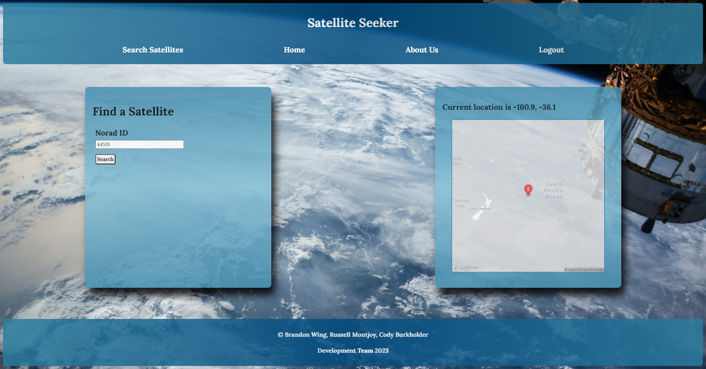

# Satellite Seeker
This project was created by: Russell Montjoy, Brandon Wing, and Cody Burkholder

## Description

The Satellite application uses the Model View Controller (MVC) paradigm to create and maintain a site for end users to track and view information related to satellites.  The `express-handlebars` module is used to integrate front end code with data retrieved from the back-end database through the controllers.  End users can create an account, view satellites, update a satellite's details, and delete a satellite from the database.  The site offers authentication and stores session information to provide views based on the user's login state.

## Table of Contents 

- [Installation](#installation)  
- [Usage](#usage)  
- [License](#license)
- [Questions](#questions)  
      
    
## Installation

No installation is required to use the application.  The application has been deployed to Heroku and can be accessed at the following URL: [Access the Deployed Heroku Application](https://satellite-seeker-6eb766f2c5fc.herokuapp.com/)

If a developer would like to access the underlying code utilized to create the application, it can be installed by cloning the repository to the local machine.  Please note, `node.js` is required in order to run this application and will need to be installed before attempting to use the code.  The package dependencies, are included within the package.json file and can be installed through a simple `npm i` command once the repository has been successfully cloned on the local computer.  The `express`, `express-handlebars`, `express-session`, `connect-session-sequelize`, `dotenv`, `mysql2`, and `sequelize` modules are all required for this application to run correctly and must be installed prior to initializing the express.js server.

## Usage

The application is initialized by running the `node server.js` command through the terminal.  When the `server.js` file is called, it will start the express.js module and provide input in the console to confirm the application is listening on the port specified.  The application is currently configured to use port 3008, but this can easily be updated using the `PORT` variable defined within the server.js file.  If not used through the Heroku deployment, the application can be accessed through a web browser using the address: `http://localhost:3008`.  If a port other than 3008 is specified, this address should be replaced with the updated port number.

When accessed, the application provides the home page through a GET request.  Existing satellites are displayed on the page.  Any user can see content on the main page.  However, users who are not logged-in will be unable to interact with additional content.  If a user tries to access content through the navigation menu, a notification will be displayed informing them they need to login.  The notification is embedded within a link that references the login / sign-up view. 

The login page has two separate forms, login and sign-up.  The login form requires a username and password.  It will query the database to find existing users and log them into the site.  The second form provides fields for users who have not created an account previously to sign-up.  A username, email address, and password are required.  The username and email address fields must be unique, a condition that is defined within the User model.

Once logged in, the user can access the `View Satellites` link to request the specific location of a satellite using geo location.  The Norad Id for the satellite is required to complete the request.  Clicking on a specific satellite name from the homepage will perform a `GET` request and render a view displaying that one specific satellite. These features are only available if the logged in value of the session is set to true.  After a user has interacted with  the content, they are able to logout using the "logout" link in the navigation menu.  The availability of this option is controlled by a conditional statement throughout the application.

## License

This application is covered under the license linked below.  For further information regarding the license and its terms, please consult the official licensing documentation using the provided link.

[License: MIT](https://opensource.org/licenses/MIT)

## Questions

If you have any questions, please feel free to contact me using the information provided below:  
  
GitHub: [chilejay7](https://github.com/chilejay7?tab=repositories)  
Email: codyburk7@gmail.com

